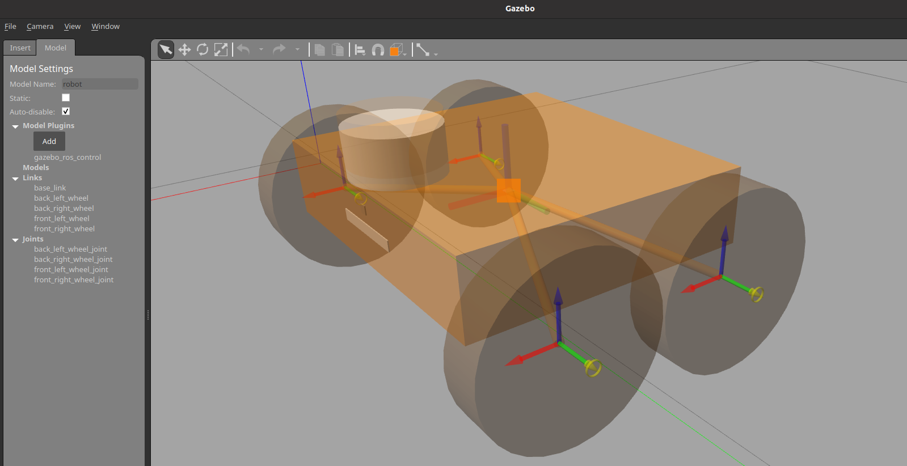
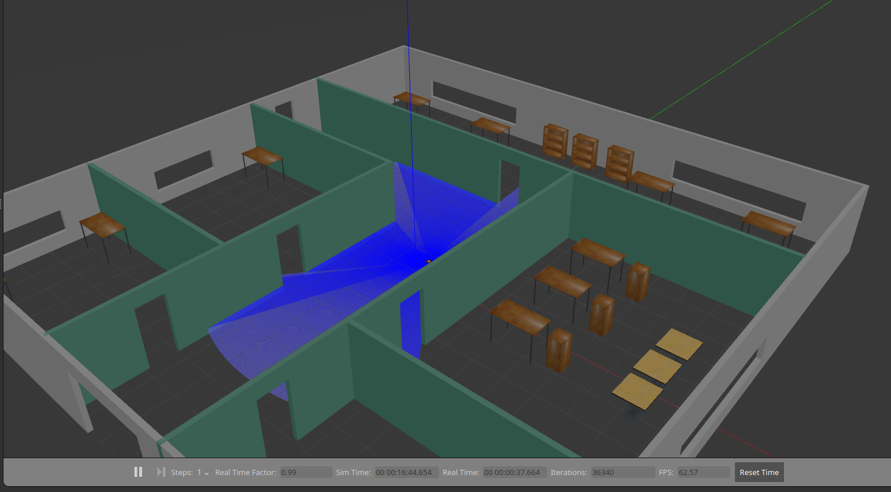

## 📋 О проекте

URDF модель 4-колесной платформы оснащенной базовыми сенсорами (камера и лидар) для запуска, настройки параметров, и исследования алгоритмов навигации, локализации и картографирования в виртуальной среде Gazebo.
Для разработки использовалась Ubuntu 20.04 и ROS Noetic.

## 📸 Демо

| Описание | image |
|----------|----------|
| 📷 URDF модель |  |
| 🗺️ Картографирование в мире Gazebo |  |
| 📊 Навигация |  |

